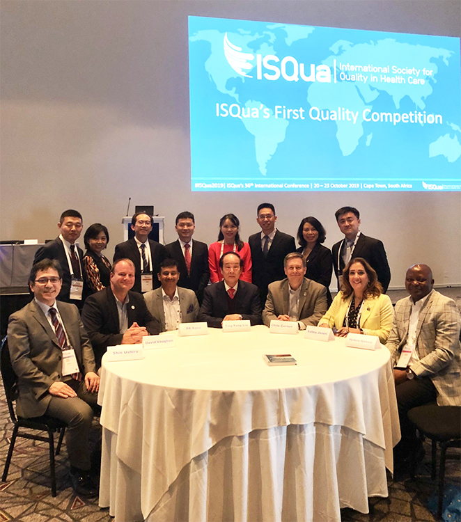

I grew up into a nuclear family of four children - two boys and two girls. We rarely fall sick, I attributed this to completing the national immunization schedule and to a functional health system that teaches preventive medicine. Only once could I remember any of my immediate family members being so sick as to need hospital admission. I believed the health system was safe, timely, and that death could be avoided on most occasions simply by presenting early in the hospital. I was completely naive.  

This thought followed me through my secondary school days. Life kept smiling on me, I was very fortunate. I had friends who shared similar thoughts and had similar experiences too. Believing in the safety culture of the healthcare system, I decided to study medicine too, become a doctor and continue saving lives. All my experiences so far did not prepare me for what was to come. There was a big gap between the healthcare system that I imagined, and the healthcare system that exists. I believed for example that a pregnant woman who register for ante-natal early, keeps her appointments, and deliver in a healthcare facility should have a healthy baby and mother, at least on almost all occasions.   

Clinical postings started in my fourth year of Medical School. Then I began to catch a glimpse of what truly exists. I realised the system is way more complicated that I thought; way beyond my imaginations. From economic challenges, to delay of access, and to failure of healthcare services to save some of those who even scale through the initial huddles and would have thought of having a short stay in the hospital.  

My brother and I entered medical school at the same time. We were in the same class throughout the 6-year training. My dad must have been a proud father, having two children who would become Medical Doctors at the same time. He would occasionally joke about us marrying another set of twins, both of who are either doctors or nurses. I am sure it was a moment he looked forward to. Dad was diabetic about the time we entered medical school, and hypertensive shortly thereafter too. I could imagine him thinking he should be fine with two children in studying medicine. He did fairly well for the first few years. During our fourth year in school, he developed blisters on the back of his left foot. Luckily enough, it was during my junior medical posting. I had had contacts on the hospital ward with people with similar history but did present to the hospital on time. Together with my brother, we were able to convince him to present to his out-patient clinic where a diagnosis of diabetic foot was made and he was admitted. While we were fearful of the diagnosis given some of our experiences, we were also relieved that he presented rather early (almost as soon as the blisters were noticed), and that he should recover in no time. 

Yet, days rolled into weeks with him on the hospital bed. Series of near events and never-events occurred from both human errors and complete systems breakdown. Once he needed blood transfusion and had a transfusion reaction needing hydrocortisone. The hydrocortisone was given at a high dose for almost 5 days instead of the prescribed 24 hours. Infact, they just kept giving the hydrocortisone until he had severe water retention making him so puffy before it was discovered. By this time, he was already past 6 weeks on hospital admission and has become very anxious. Yet another time, he was made to fast till about 5:00pm (for a diabetic client) for a theatre procedure that should not take up to an hour, yet the procedure was cancelled.  

The big shock came at about 2 months into hospital admission. He had just recovered from his wound that became infected because of the delay with his skin graft. He had become weak he needed support to sit up in bed. He needed to eat, the family member staying with him went to inform the nurses about this at their station. She was asked to support him to sit up and feed, perhaps because she could not support his weight or because she felt carrying his head up on the bed was enough, she fed him a liquid diet but ended up aspirating in the process. That was the beginning of the end. He died less than 5 days later due to sepsis as a result of the aspiration (pneumonia).  

I could not stop seeing similar stories all around me. Human errors everywhere, collapsing and failing health systems. The loss of a person is always 100% mortality to the family involved. More especially when they feel the death could have been avoided. Like the Donabedian model, failure structure and processes can only lead to one type of outcome, bad ones.

How do you convince people that the healthcare system saves lives? How do you convince people to present early to the hospital and not seek alternative treatment when the people they know that presented early did not come back home? How do you convince the family not to give up on their family member who is admitted, especially for chronic ailment? The questions were endless. The more I asked, the more questions kept coming. Is this the best our health system can do? What happens when I become a consultant, is this the same system I will be working in? I knew that like most of my colleagues, I probably would be forced to find my way to a country where the systems work. But then I could not stop thinking of the fate of the poor masses, and the extended family members I have scattered in the country.   

While still asking these questions, I wrote and passed my entry (Primaries) exams for Surgery Residency. But I could not bring myself to start the programme. I could see brilliant Surgeons who are handicapped by the health system and I was scared of becoming one too. I wanted to help the system, not to become drowned by it along the way. It was during this period that a colleague introduced me to [**ISQua Fellowship** programme](https://isqua.org/). During the programme, I also had the opportunity of taking courses too from the [**Institute for Healthcare Improvement**](https://ihi.org) and the [Royal College of Surgeons in Ireland (RCSI) **Institute of Leadership**](https://rcsi.com/leadership/). Finally, I felt the burning questions on my mind being answered. The Fellowship programme gave me the much-needed direction. And so, began my journey into quality healthcare and patient safety.  

First, I started in the hospital where I was working. I established a quality improvement team which I led to implement a couple of QI projects one of which won the Runners-up award of the first [**ISQua International QI Competition**](https://linkedin.com/pulse/sawubona-reflecting-isquas-annual-meeting-cape-town-south-cornue/). Then I moved to the public health space to be able to support health facilities and communities across the country most especially and the globe at large.  

  

Since 2013, I have continued in this light. Though the journey has not been easy (didn't expect that it would), but it has been worth every bit of it. I find joy and satisfaction in the lives we reach through supporting and strengthening healthcare systems to deliver safe and quality healthcare which has led to improving health outcomes (performance indicators) across these sites. This has continued to fuel my passion and drive. 

Thanks to all those who have supported and contributed to my quest for quality improvement and patient safety, specially to [ISQua](https://isqua.org) for providing the learning platform and the ISQua community for the support; the Medical Director and President of [Olanrewaju Hospital](https://olanrewajuhospital.com.ng/), Ilorin Kwara State where my practical QI experience started; and my mentors, [Prof. Anthony Staines](https://twitter.com/AnthonyStaines), and [Dr David Vaughan](https://twitter.com/davidjvaughan).  

My vision is a country where healthcare workers recognize the role of quality improvement and patient safety and apply these daily in our quest to delivering on our promise, health - the state of complete physical, mental and social well-being and not merely the absence of disease or infirmity, everywhere, every time.

