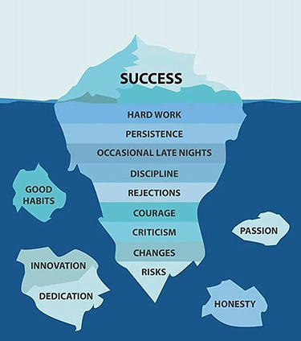

Going through my personal emails one faithful evening, like I usually do after the day's work, I came upon on an email stating that I am being considered as an Ambassador of ISQua.  We had an online meeting to discuss this shortly after along with other candidates under consideration. It felt like I have won a million-dollar jackpot. It was yet another dream come through, being recognized for the works that I do and considered worthy to be called an **Ambassador** of an international organization like [ISQua](https://isqua.org/). And the [**official announcement**](https://inewsletter.co/vPbjd1/isqua-fellowship-newsletter-march-2020/#/3) finally came in the evening of 5th March 2020. Being an Ambassador is a great privilege and responsibility. One I intend to see through and make everyone who has believed in me, and entrusted me with this much, proud.  

All these did not happen overnight. Over the years, I have dedicated my time to promoting Quality Improvement and Patient Safety in my own way. Having been a Fellow of the same organization since 2013 and a member since 2016, both with annual cost implications for renewal. I remember going to the 36th ISQua conference all cost borne by me. For someone like me, the cost implication was significant, eating deep into my annual savings and also because I was just recovering from some costs I had just incurred. People asked why I would want to spend so much of my personal money attending such a conference without complete or partial scholarship, but it never deterred me.  Knowing exactly why I do the things I do, I went to the conference, my very first International conference, and came back having made 4 presentations and won two recognitions - **Delegates' choice poster award**, and the **Runner-up** of the first ISQua QI competition.  

  

Like the [**Iceberg theory**](http://katelynshelby.me/blog/2017/2/15/the-iceberg-theory-of-success), success comes with a whole lot of hard work, passion, perseverance, cost and courage. Keep pushing, even when you are weak. Keep going, even when you are discouraged, your success is right at the corner. Like one of my favorite quotes:

> “If one advances confidently in the direction of his dreams, and endeavors to live the life which he has imagined, he will meet with a success unexpected in common hours…” 
                  - Henry David Thoreau, Walden   
                  
Continue to fuel your passion, success will definitely be yours!!!!  

Do send me a message or leave a comment if you will like to know more about [**ISQua**](https://isqua.org/)   

[**_Fuel your passion_** - ISQua Ambassadors](https://inewsletter.co/vPbjd1/isqua-fellowship-newsletter-march-2020/#/3)  

