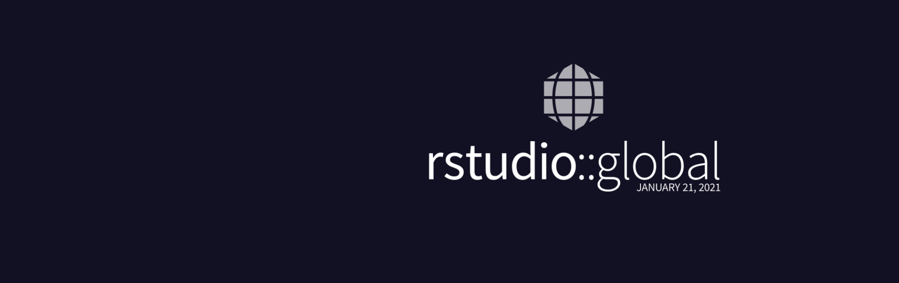

In January 2021, I received an email that I have been selected as a recipient of the [rstudio::global(2021)]() Diversity Scholarship.The conference held on the 25th and 26th of January 2021. I had the opportunity of networking with other participants and attending two workshops during the virtual conference. The workshops were led by [Mine Çetinkaya-Rundel](http://mine-cr.com/) and [Alison Presmanes Hill](https://alison.rbind.io/).

[Mine](http://mine-cr.com/) taught us "What they forgot to teach you about R". It was wonderful learning about [RStudio cloud](https://rstudio.cloud/), creating [{learnr}](https://rstudio.github.io/learnr/) tutorials and using R Markdown-based tools for teaching.

[Alison's](https://alison.rbind.io/) workshop was titled "Introducing yourself online". The workshop consolidated my knowledge of RStudio cloud, building websites and blogs using various platforms available in R, and hosting blogs/websites on free servers. Thanks to the knowledge from the workshop and other online materials, I have been able to build this website using the [{Distill}](https://rstudio.github.io/distill/) package.

