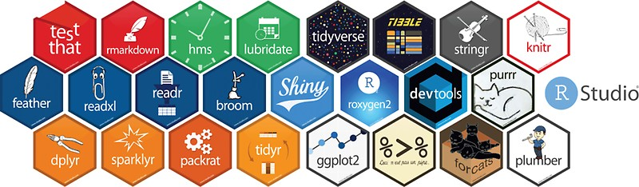

I released [{tidyndr}](https://cran.rstudio.com/web/packages/tidyndr/) version 0.2.0 on CRAN on 5th January 2022. This version came with several new functions and upgrade of previous functions. The package now supports analysis of both NDR treatment and HIV-1 recent infection line-lists. Learning `s3 objects` from [Hadley Wickham's](https://hadley.nz/) [R Packages](https://r-pkgs.org/) and [Garrett Grolemund's](https://www.linkedin.com/in/garrett-grolemund-49328411) [Hands-on Programming with R](https://rstudio-education.github.io/hopr/) books, I created a couple of `s3 objects` in this version to support comprehensive data analysis of the various line-lists. I also leveraged on the {[rlang}](https://rlang.r-lib.org/) package to improve analysis of listed objects and iterations.

I am currently working on a new release to extend the functionalities. I have benefited from contributions from colleagues in the past. I am still open to collaborations and contributions. Kindly check the package and do reach out for questions, clarifications and possible collaborations.

