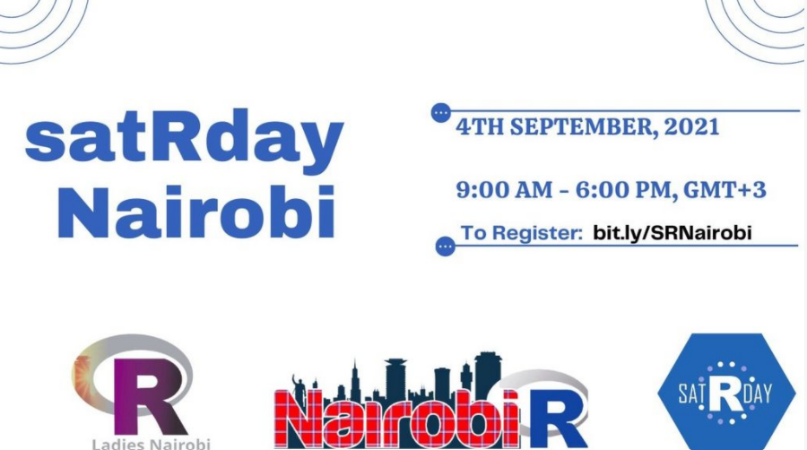

```{r setup, include=FALSE}
knitr::opts_chunk$set(echo = FALSE)
library(fontawesome)
```


 

On the 4th of September 2021, I facilitated a workshop session at the [satuRday Nairobi virtual conference](https://nairobi2021.satrdays.org/). During the session, we went through the step-by-step process of R package development and deployment. The workshop materials can be found in the link below:


*   `r fa("paperclip")` [webpage](https://stephenbalogun.github.io/pkg_steps/pkg_dev.html)

*   `r fa("file-powerpoint")` [slides](https://stephenbalogun.github.io/pkg_steps/pkg_dev.html)

*   `r fa("github")` [source code](https://github.com/stephenbalogun/pkg_steps)
  
