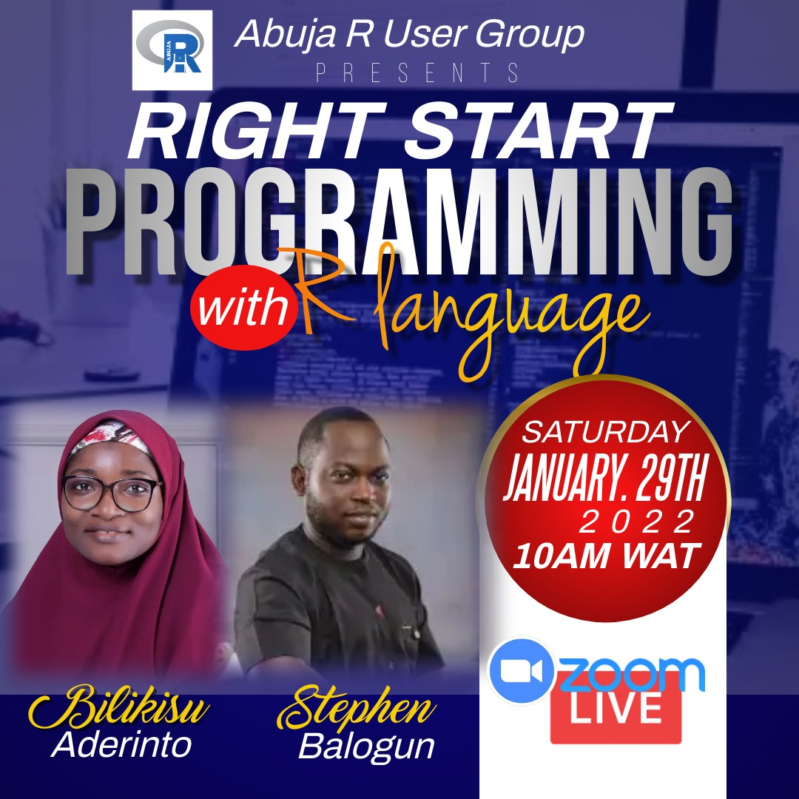

```{r setup, include=FALSE}
knitr::opts_chunk$set(echo = FALSE)
library(fontawesome)
```




Come Saturday, 29th January, 2022. I will be co-facilitating a workshop with [Bilikisu Wunmi Aderinto](https://rladies.org/nigeria-rladies/name/bilikisu-aderinto/) on [Right Start Programming with R Language](https://www.meetup.com/Abuja-R-User-Group-Meetup/events/283116884/). Make it a date with us, register `r fa("hand-o-right")` [here](https://www.meetup.com/Abuja-R-User-Group-Meetup/events/283116884/)!


