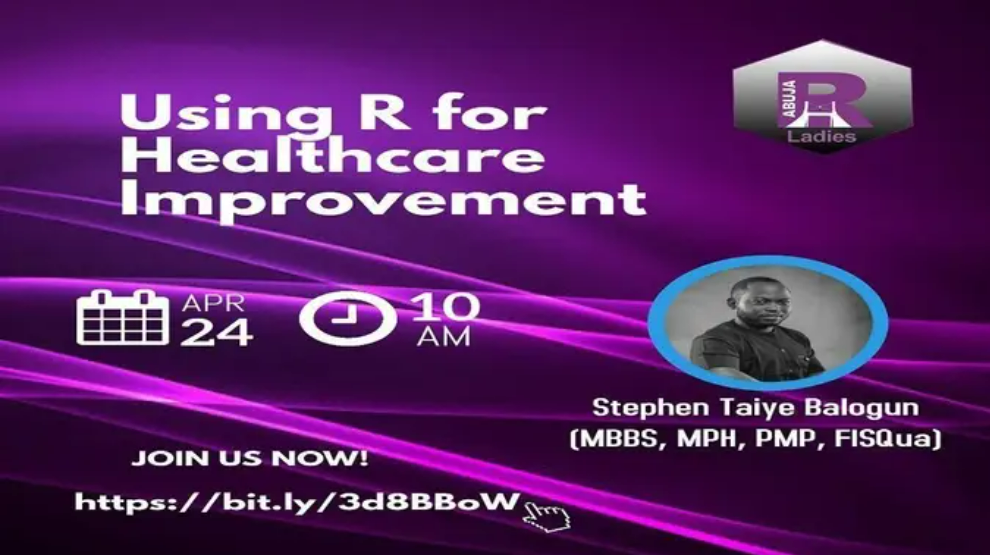

```{r setup, include=FALSE}
knitr::opts_chunk$set(echo = FALSE)
library(fontawesome)
```




I was invited by the organizers of [R-Ladies Abuja](https://www.meetup.com/rladies-abuja/events/277486120/) to share my thoughts how I utilize R software within the healthcare industry. I discussed the power of R in designing interactive dashboards and the usefulness, especially during the peak of the pandemic. I also talked about how I use R scripts to automate analysis and how over time, I have organized the scripts into an R package - {tidyndr}.

*   `r fa("file-powerpoint")` [Slides](https://stephenbalogun.github.io/abuja_r_ladies/using_r_for_healthcare_improvement2.html#1)
    
    
*   `r fa("video")` [Recording](https://www.youtube.com/watch?v=yjZiZRnfdLU)


*   `r fa("github")` [Repository](https://github.com/stephenbalogun/abuja_r_ladies)

    
    


